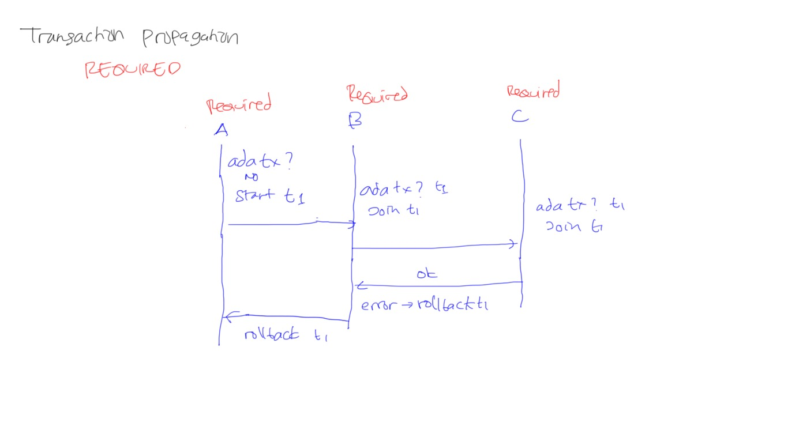
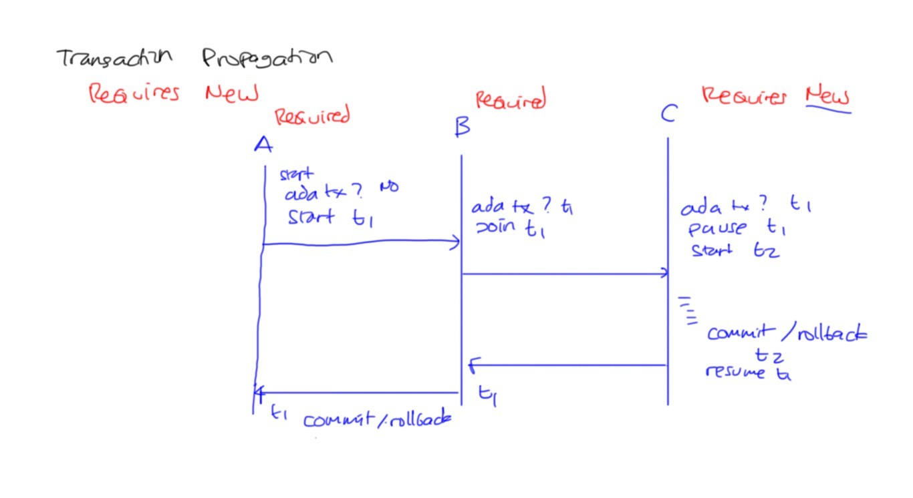
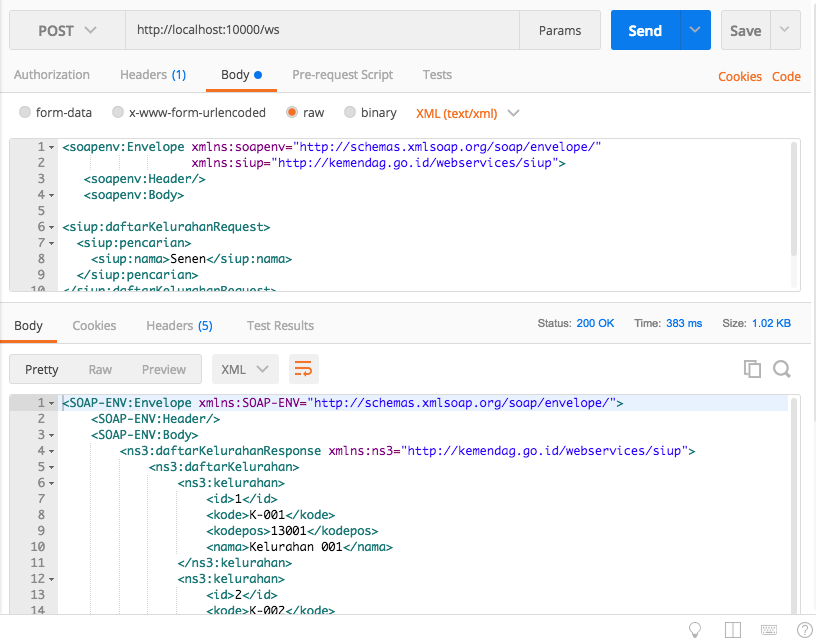

# Akses Database #

Berbagai metode akses database:

* [JDBC : Java DataBase Connectivity](#jdbc)
* [ORM](#orm-object-relational-mapping)
* [Managed Connection / Transaction](#connection-transaction-management)
* [Spring Data JPA](#spring-data-jpa)


## JDBC ##

1. Load library
2. Connect
3. Begin Transaction
4. Konversi input/parameter menjadi SQL parameter
5. Execute SQL
6. Commit / Rollback
7. ResultSet
8. Konversi ke Object
9. Disconnect

Contoh yang salah

```java
String username = request.getParameter("username");
String password = request.getParameter("password");

String sql = "select * from t_user where ";
sql += "username = '"+username+"' ";
sql += "and password = '"+password+"'";

ResultSet rs = dbConnection.createStatement(sql).executeQuery();
```

Jangan sambung SQL seperti di atas, karena rawan SQL Injection.
Misalnya, username diisi nilai `1';delete from t_user;`

Hasilnya :
* `select * from t_user where username = '1';delete from t_user;' and password = '123';`
* no record, hapus tabel t_user, error

Contoh yang benar, menggunakan PreparedStatement

```java
String username = request.getParameter("username");
String password = request.getParameter("password");

String sql = "select * from t_user where ";
sql += "username = ? ";
sql += "and password = ?";

PreparedStatement psLogin = dbConnection.prepareStatement(sql);
psLogin.setString(1, username);
psLogin.setString(2, password);

ResultSet rs = psLogin.executeQuery();
```

Keuntungan menggunakan PreparedStatement:

* Menghindari SQL Injection
* Lebih optimal, karena SQL bisa dicompile dan di-cache oleh library database ataupun database server.

## ORM : Object Relational Mapping ##

Fungsi utama :

* Mapping antara tabel dan class
* Konversi dari ResultSet menjadi Object
* Generate SQL untuk tiap merek/versi database

Fungsi tambahan :

* Optimasi eksekusi SQL
* Cache

Beberapa produk ORM populer:

* Hibernate : tadinya opensource independen, kemudian jadi punya JBoss (Redhat)
* Toplink (berbayar) : Oracle
* EclipseLink (open source/gratis) : tadinya Toplink Essential (versi community)

Mitos ORM :

* Lebih lambat : tidak signifikan, masih acceptable
* SQL tidak optimal : belum tentu, karena programmer ORM lebih paham database daripada rata-rata programmer pengguna database

## Connection & Transaction Management ##

Fungsi utama:

* Connection pooling

    * minimum idle : jumlah minimum yang tetap connect walaupun sedang idle
    * max active : jumlah maksimum koneksi yang boleh dibuat
    * idle timeout : waktu idle maksimal sebelum disconnect
    * max wait : batas waktu menunggu koneksi tersedia, default unlimited. Kalau lewat max wait belum dapat koneksi, maka akan error.

* Transaction Management

   * Programmatic
   * Declarative : pakai annotation di method. Seluruh isi method dijalankan dalam satu scope transaction.
   * Managed transaction : transaction dikelola oleh Transaction Service.

Fitur Managed Transaction

* Distributed / XA Transaction / Two Phase Commit : transaction lintas database (lebih dari satu database)
* Transaction Propagation

    * REQUIRED : kalau belum ada transaction, start. Kalau sudah ada, ikut.
    * REQUIRES_NEW : kalau sudah ada, pause, jalan di transaction baru. Setelah selesai resume transaction sebelumnya
    * MANDATORY : kalau sudah ada, ikut. Kalau belum ada, error
    * SUPPORTS : kalau sudah ada, ikut. Kalau belum ada, jalan tanpa transaction
    * NOT SUPPORTED : kalau sudah ada, pause. Kalau belum ada, jalan tanpa transaction
    * NEVER : kalau sudah ada, error. Kalau belum ada, jalan tanpa transaction


[](img/15-transaction-propagation-required.jpg)

[](img/16-transaction-propagation-requires_new.jpg)


## Spring Data JPA ##

Fitur :

* tidak perlu menulis kode program untuk CRUD.
* query method : nama method otomatis dikonversi jadi query.

    Contoh : `List<User> findByNamaContaining(String nama)`
    akan menghasilkan SQL : `select * from t_user where nama like %nama%`

* pagination
* integrasi dengan aplikasi web untuk:

    * konversi id ke object. `http://localhost/user?id=1`
    * param untuk paging dan sorting. Param `page`, `rows`, `sort` otomatis dikenali

## Implementasi Akses Database ##

Langkah-langkah:

1. Tambahkan library di `pom.xml`

    * Database driver

    ```xml
    <dependency>
        <groupId>mysql</groupId>
        <artifactId>mysql-connector-java</artifactId>
    </dependency>
    ```

    * Migration

    ```xml
    <dependency>
        <groupId>org.flywaydb</groupId>
        <artifactId>flyway-core</artifactId>
    </dependency>
    ```

    * Spring Data JPA

    ```xml
    <dependency>
        <groupId>org.springframework.boot</groupId>
        <artifactId>spring-boot-starter-data-jpa</artifactId>
    </dependency>
    ```

2. Buat migration script di file `src/main/resources/db/migration/V1.0.0.2018022301__Skema_Kelurahan`

    ```sql
    create table kelurahan (
        id INT PRIMARY KEY AUTO_INCREMENT,
        kode VARCHAR(10) NOT NULL UNIQUE,
        nama VARCHAR(255) NOT NULL, 
        kodepos VARCHAR(10) NOT NULL
    );
    ```

3. Buat konfigurasi koneksi database
4. Buat user database dan databasenya
5. Buat entity mapping class dengan tabel
6. Buat DAO
7. Gunakan di aplikasi web

### Konfigurasi Koneksi Database ###

Tambahkan baris berikut di `src/main/resources/application.properties`

```
spring.datasource.url=jdbc:mysql://localhost/siupdb
spring.datasource.username=siupdbuser
spring.datasource.password=siup123

spring.jpa.show-sql=true
spring.jpa.properties.hibernate.format_sql=true
```

### Membuat user database ###

1. Login ke mysql

        mysql -u root
        mysql>

2. Buat user database

        grant all on siupdb.* to siupdbuser@localhost identified by 'siup123';

3. Buat database

        create database siupdb;

### Entity Class ###

Buat entity class yang berpadanan dengan skema database. Misalnya kita buat class `Kelurahan` dalam package `entity` seperti ini:

```java
@Data
@Entity @Table(name = "kelurahan")
public class Kelurahan {
    
    @Id @GeneratedValue(strategy = GenerationType.AUTO)
    private Integer id;
    
    @NotNull @NotEmpty
    private String kode;
    
    @NotNull @NotEmpty
    private String nama;
    
    @NotNull @NotEmpty
    private String kodepos;
}
```

Annotation `@Table` opsional, tidak perlu dipakai kalau nama class dan nama tabel mengikuti aturan penamaan standar. Bila kita menggunakan Spring Boot, aturannya sebagai berikut:

* huruf depan dibuat jadi kecil. Misalnya nama class `Kelurahan` akan menjadi nama tabel `kelurahan`
* CamelCase menjadi snake_case. Misalnya `KantorCabang` menjadi `kantor_cabang`
* demikian juga nama variabel dan nama kolom. Variabel `String jenisKelamin` akan dimapping ke kolom `jenis_kelamin varchar(255)`

### Data Access Object ###

Spring Data JPA sudah membuatkan method-method yang sering dipakai, seperti misalnya:

* findAll : akan menjalankan query `select * from nama_tabel`
* findOne : `select * from nama_tabel where id = ?`
* save : bila variabel `id` kosong, menjalankan `insert into nama_tabel`. Bila ada isinya, menjalankan `update nama_tabel set ... where id = ?`
* dan seterusnya

Kita hanya perlu membuat interface yang extends dari beberapa interface yang disediakan Spring, misalnya:

* CrudRepository
* PagingAndSortingRepository

Berikut interface `KelurahanDao` yang ada dalam package `dao`

```java
public interface KelurahanDao extends PagingAndSortingRepository<Kelurahan, Integer>{
    
}
```

Selanjutnya, kita bisa gunakan dalam endpoint yang sudah dibuat sebelumnya:

* Deklarasikan variabelnya dan berikan annotation `@Autowired` agar diisi oleh Spring

    ```java
    @Autowired private KelurahanDao kelurahanDao;
    ```

* Jalankan method `findAll` untuk mengambil data dari database

   ```java
   Iterable<Kelurahan> data = kelurahanDao.findAll();
   ```

Source code lengkapnya bisa dilihat [di sini](../aplikasi-siup/src/main/java/id/go/kemendag/siup/aplikasisiup/endpoint/KelurahanEndpoint.java)

[](img/17-hasil-query.png)

## Referensi ##

* [Java Transaction Design Strategies](https://www.infoq.com/minibooks/JTDS)