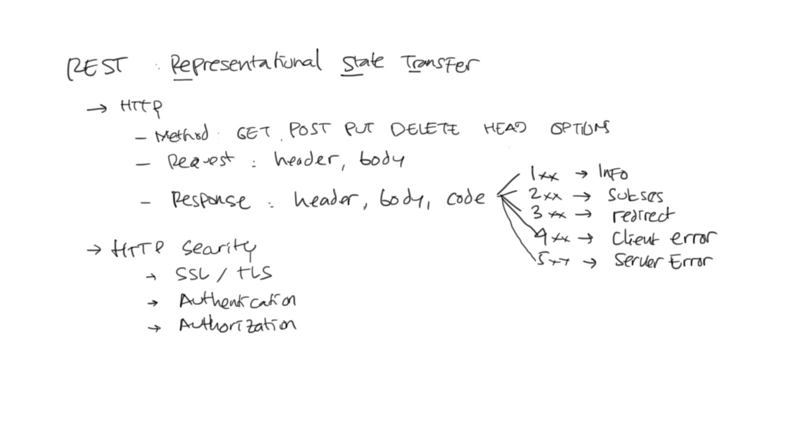

# Konsep Web Service #

* Web Service artinya layanan (service) yang bisa diakses aplikasi lain melalui web (protokol HTTP)
* Web Service adalah salah satu cara untuk integrasi antar aplikasi

Berbagai cara untuk integrasi antar aplikasi:

* Web Service
* Messaging
    * Email
    * SMS
    * Message Broker
* Socket : misalnya ISO8583
* Database
* File

Macam-macam web services:

* XMLRPC
* SOAP
* Hessian/Burlap
* RMI over HTTP
* Spring HTTP Invoker
* REST

## REST ##

* Singkatan dari Representational State Transfer
* Menggunakan protokol HTTP secara lebih maksimal

Macam-macam HTTP Method

* GET
* POST
* PUT
* DELETE
* HEAD
* OPTIONS

Komponen HTTP Request:

* Header
* Body

Komponen HTTP Response:

* Response Code
* Header
* Body

Macam-macam HTTP Response Code :

* 1xx : Informasi
* 2xx : Sukses
* 3xx : Redirect
* 4xx : Client Error
* 5xx : Server Error

## Referensi ##

* https://www.ibm.com/developerworks/library/ws-whichwsdl/
* https://en.wikipedia.org/wiki/XML-RPC
* https://en.wikipedia.org/wiki/Representational_state_transfer
* https://simple.wikipedia.org/wiki/SOAP_(protocol)
